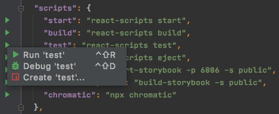
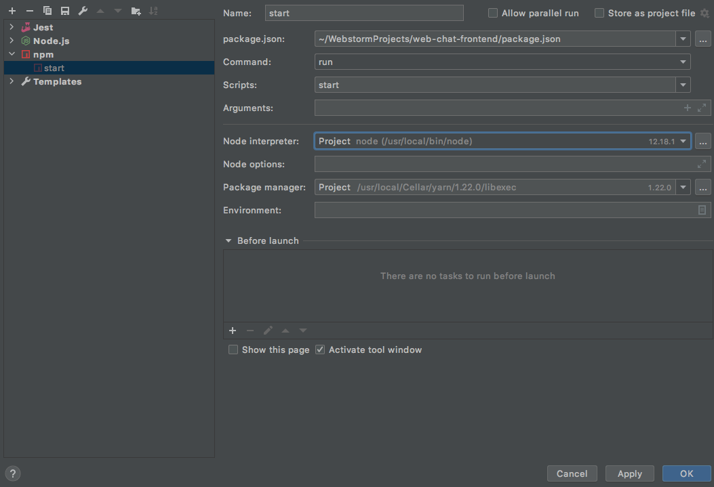
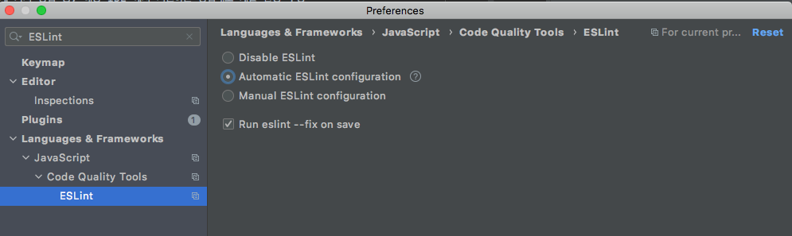

# 소개
> web chat application


# 프로젝트 구조

## 디렉토리 구조

```
├───.github
│   ├───ISSUE_TEMPLATE
│   └───workflows
├───.storybook
├───public
├───src
│   ├───__snapshots__
│   ├───common
│   ├───components
│   │   ├───atoms
│   │   ├───molecules
│   │   └───organisms
│   ├───css
│   ├───mock
│   │   ├───room
│   ├───pages
│   │   ├───chat
│   │   │   └───room
│   │   │       └───templates
│   │   ├───error
│   │   │   └───nomatch
│   │   │       └───templates
│   │   └───rooms
│   │   │   ├───board
│   │   │   │   └───templates
│   │   │   └───maker
│   │   │       └───templates
│   ├───service
│   └───utility
```


# Getting Started

## Intellij

### 실행 방법
> 세 가지 방법 중, 해당 IDE 에서 지원하는 방법대로 개발 환경 구성

1. `package.json`에서 오른쪽 마우스 클릭 후, 실행 방법 선택

    

2. `Edit Configurations...` 에서 `+` 버튼 클릭 후, 아래 그림과 같이 설정

    

3. Terminal 에서 아래 명령어 직접 입력

    > yarn start
    > yarn test

### Linter

- ESLint 사용
- 저장할 때마다 Linter를 적용하고 싶다면 아래 그림처럼 설정

    

# DevOps

## 빌드
> yarn build

## 테스트
> yarn test
>
> yarn test -u

# 협업 도구

- [⚽ Storybook](https://5f33863115bb7700228d6fa0-xspzuawezf.chromatic.com/)
- [🏕 Chromatic](https://www.chromatic.com/library?appId=5f33863115bb7700228d6fa0)
- [⛱ Slack](https://app.slack.com/client/TH6LT721Z/learning-slack)

# Team

- 이성온 [@so3500](https://github.com/so3500)
- 김아윤 [@ahyoon99](https://github.com/ahyoon99)
- 권예경 [@KwonYeKyeong](https://github.com/KwonYeKyeong)
- 고승빈 [@raccoonback](https://github.com/raccoonback)
